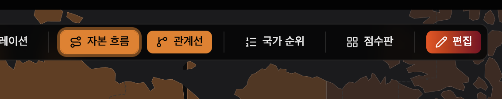
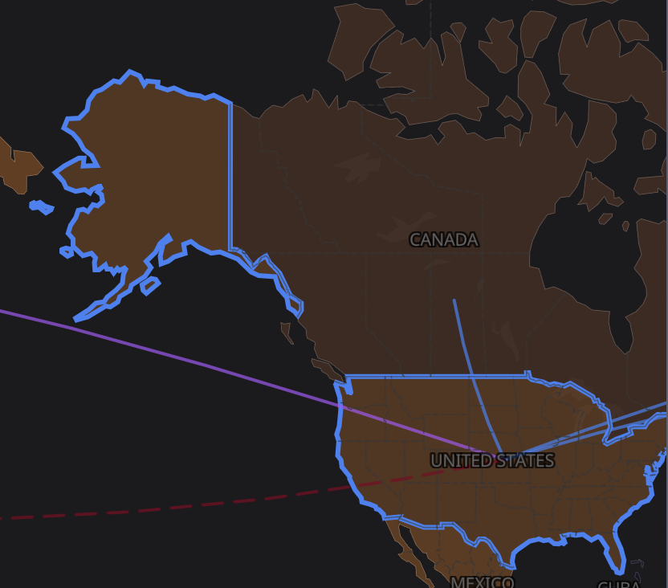
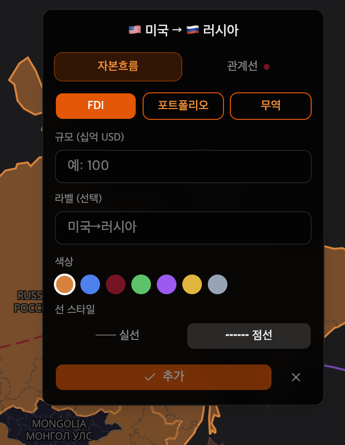

# Gordon Project & 윌리엄 망고단 과제 제작
 - 지도들을 구해야한다는 엄청난 귀차니즘에서 시작되었고
 - 어처피 제 프로필 웹사이트가 필요했고.... 하하하
 - 이 프로젝트를 가져가서 업그레이드 하실 개발자분들은 꼭 연락주세요(맵 데이터 깨집니다. 드려야해서 그래요 ㅠㅠ)

> [!IMPORTANT]
> 1. 이건 언제나 제가 하고싶어서 한거라서 강요나 금전을 취하는 행위는 절대하지않음(상단에 광고하나 들어갈 수 있음 서버비 이해좀 ㅠ)
> 2. 특히 이 과제의 주인의 허락이 없으면 배포 후 언제나 중단할 의향이 있다는 점 참고
> 3. 원하는 내용이나 망고단분들이 불편해서 자동화하고 모든 프로젝트를 여기에 포함시켜서
>   - 원하는 프로그램들을 여기서 다 편히 볼 수 있게 하는걸 목표로 하고 있음
> 5. 회원가입은 여러분들이 메모한 기능 그리고 공부했던 내역들을 저장할려고 만듦 (그래야 편하게 또 보고 수정할거니까~ ) 

## 사용법
 - 추가 예정인데 너무 엄청 길어서 그냥 쓰레드로 알려줘야하나....?
 - 웹에 접속해서 살짝 내리면 dashboard 버튼이 상단 오른쪽에 있는데 그걸 눌러서 로그인하면 작업가능

    > [!NOTE]
    > 현재 macro-map 페이지에서 지도에 데이터를 못가져오는 게 존재합니다.
    > 1. 기준금리, 2. 국가 채무, 3. 군사력 순위, 4. 핵신산업, 5. 기술력
    > 
    > 위 데이터들을 못가져오게 되었어서 dummy 데이터이기 때문에 꼭 본인이 확인해주세요.
    > 산업 및 군사력 부분은 언제든지 작업해서 저장하고 불러올 수 있으니까 참고!
    
    1. 세계경제 과제 사용법
        
        - 이미지 참고
        
        

            
        

        
        - 위 이미지 처럼 상단에 버튼이 있음
        - 편집버튼을 누르면 관계 혹은 라인들 설정가능
        - 옆에 자본흐름 버튼과 관계선 버튼을 누르면 on/off 가능

        

            
        

        

            
        

## 현재 완료
- v0.0.1 (2025.04.03)
  - 백엔드 연결 : 언제든지 메모처럼 저장해서 여러분들이 볼 수 있음
  - 세계경제 과제 완료 : 지금 베타로 완료되었으나 필요한 기능들이 있다면 언제든지 연락주세요
  - 비밀지도 과제(ing...) : 모바일 대응은 안해놓은 상태 꼭 웹에서 작업하세요.
  - dashboard 지표: dashboard에 우리 아이폰에 배포되었던 데이터들은 가져올 수 있게 만들어놓음

## 추가  예정
- 라자냐 과제
- 비밀지도 과제 완료예정
- 대차대조표나 추가적인 지표 귀찮았던 부분들 추가 예정

